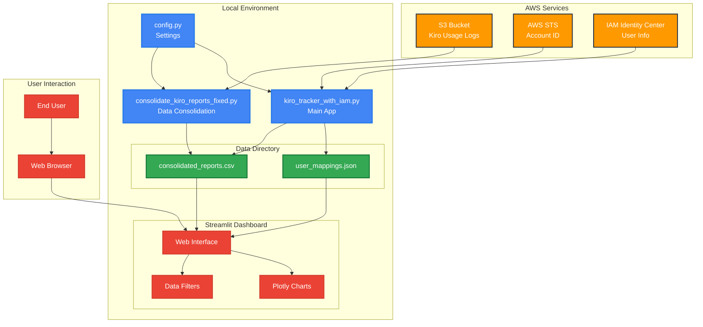

# Kiro Usage Analytics & Reporting

## 목적
Amazon Q Developer(Kiro) 사용에 대한 분석 및 리포팅 도구로, 사용자들의 사용 현황을 파악하는데 도움을 제공합니다. IAM Identity Center와 연동하여 실제 사용자명과 이메일을 표시하고, S3에 저장된 사용 로그를 분석하여 시각화된 대시보드를 제공합니다.

## 아키텍처



## 데모
🎥 **데모 영상**: [YouTube 링크 (추후 업데이트 예정)](https://youtube.com/placeholder)


*화면 캡처 이미지 (추후 업데이트 예정)*

## 필요한 라이브러리 설치

```bash
pip install streamlit pandas plotly boto3 pathlib
```

## 사용 방법

### 1. 설정 파일 구성
`config.py`에서 S3 버킷명과 리전을 설정:
```python
BUCKET_NAME = "your-kiro-report-bucket"
DEFAULT_REGION = "us-east-1"
```

### 2. AWS 자격 증명 설정
AWS CLI 또는 환경 변수로 AWS 자격 증명을 설정해야 합니다:
```bash
aws configure
# 또는
export AWS_ACCESS_KEY_ID=your_key
export AWS_SECRET_ACCESS_KEY=your_secret
export AWS_DEFAULT_REGION=us-east-1
```

### 3. Streamlit 앱 실행

**온라인 버전** (AWS 크레덴셜 필요):
```bash
streamlit run kiro_tracker_with_iam.py
```

**오프라인 버전** (AWS 크레덴셜 불필요):
```bash
streamlit run kiro_tracker_offline.py
```

### 4. 대시보드 사용법

#### 4.1 메인 대시보드 화면


애플리케이션을 실행하면 다음과 같은 기능들을 확인할 수 있습니다:

**좌측 사이드바:**
- **현재 설정**: 버킷명과 계정 ID 자동 표시
- **리전 선택**: 분석할 AWS 리전 선택 (us-east-1 등)
- **날짜 범위**: 전체 기간 또는 최근 N일 선택
- **리전 데이터 통합**: 선택된 리전의 데이터를 로컬로 수집
- **데이터 파일**: CSV 파일 선택 및 관리
- **분석 모드**: 사용자 분석, IAM 매핑 관리, 개별 사용자 상세 분석

**메인 화면:**
- **사용자 분석 (실제 이름 포함)**: IAM Identity Center 연동으로 실제 사용자명 표시
- **패턴 분석 대상자**: 총 사용자 수 표시
- **주요 지표**: Chat 메시지 수, 코드 라인 수, 평균 수락률, IAM 인증 사용자 수

#### 4.2 사용자별 상세 정보


**사용자별 상세 정보 테이블:**
- **포지션**: 사용자 순위
- **이메일**: 실제 이메일 주소 (IAM Identity Center 연동)
- **사용자명**: bedrock_ 접두사가 붙은 사용자 ID
- **데이터 소스**: iam_identity_center로 실제 정보 확인
- **Chat 메시지**: 총 대화 수
- **코드 라인**: 생성된 코드 라인 수
- **수락률 (%)**: 코드 수락 비율
- **활동 일수**: 사용 기간
- **사용 스타일**: Heavy/Light User 분류
- **처음/마지막 활동**: 사용 기간 추적

#### 4.3 시각화 차트


**사용자별 시각화:**
- **상위 10명 사용자별 Chat 메시지 수**: 막대 차트로 사용량 비교
- **Inline 제안 수 vs 수락률 (크기: 코드 라인 수)**: 산점도 차트로 상관관계 분석

#### 4.4 데이터 파일 관리


**CSV 파일 선택:**
- 드롭다운에서 분석할 CSV 파일 선택
- `consolidated_multiregion_` 접두사로 시작하는 통합 파일들
- 날짜별로 구분된 파일 목록

**IAM Identity Center 상태:**
- 🟢 연결됨: IAM Identity Center 정상 연동 상태
- 매핑된 사용자 수 표시 (예: 3명)

### 5. 데이터 통합 (선택사항)
S3의 분산된 CSV 파일들을 하나로 통합:
```bash
python consolidate_kiro_reports_fixed.py --days 7 --output consolidated_reports.csv
```

### 6. 주요 기능 활용

#### 6.1 실시간 사용자 분석
- IAM Identity Center 연동으로 실제 사용자명과 이메일 확인
- 사용 패턴 분석 (Heavy User vs Light User)
- 코드 수락률 및 생산성 지표 모니터링

#### 6.2 시각화 대시보드
- 인터랙티브 차트로 데이터 탐색
- 사용자별, 기간별 비교 분석
- 실시간 필터링 및 정렬 기능

#### 6.3 데이터 내보내기
- CSV 형태로 분석 결과 다운로드
- 사용자 정의 기간 설정
- 다중 리전 데이터 통합

## 파일 구조

```
kiro_usage/
├── kiro_tracker_with_iam.py          # 메인 Streamlit 앱 (온라인 버전)
├── kiro_tracker_offline.py           # 오프라인 Streamlit 앱 (파일 업로드 버전)
├── consolidate_kiro_reports_fixed.py # S3 데이터 통합 스크립트
├── config.py                         # 공통 설정 파일
├── iam_identity_center_mapper.py     # IAM Identity Center 연동 모듈
├── data/                            # 로컬 데이터 저장소
│   ├── consolidated_reports.csv     # 통합된 리포트 데이터
│   └── user_mappings.json          # IAM Identity Center 사용자 매핑
├── README.md                        # 이 파일
└── demo_screenshot.png             # 데모 스크린샷 (추후 추가)
```

## 주요 기능

### 1. 온라인 버전 vs 오프라인 버전

| 기능 | 온라인 (`kiro_tracker_with_iam.py`) | 오프라인 (`kiro_tracker_offline.py`) |
|------|-------------------------------------|--------------------------------------|
| AWS 크레덴셜 | 필요 | 불필요 |
| S3 직접 접근 | ✅ | ❌ |
| IAM Identity Center 연동 | ✅ 자동 | ✅ 선택적 |
| 데이터 입력 방식 | S3에서 자동 수집 | CSV 파일 업로드 |
| 사용 시나리오 | AWS 환경에서 실시간 분석 | 로컬 환경에서 오프라인 분석 |

**오프라인 버전 사용 시나리오:**
- AWS 크레덴셜 없이 분석이 필요한 경우
- 다른 팀에서 받은 CSV 파일을 분석할 때
- 로컬 환경에서 빠르게 데이터를 확인할 때

### 2. IAM Identity Center 연동
- 실제 사용자명과 이메일 주소 표시
- 사용자 ID를 실명으로 매핑
- 자동 사용자 정보 캐싱

### 3. 데이터 분석 및 시각화
- **사용자별 활동 분석**: 개별 사용자의 Kiro 사용 패턴
- **시간대별 사용량**: 일별, 주별, 월별 사용 트렌드
- **기능별 사용 통계**: 코드 생성, 질문 답변 등 기능별 분석
- **대화형 차트**: Plotly를 활용한 인터랙티브 시각화
- **기능별 사용 비율**: 도넛 차트로 Chat, Inline 등 기능 비율 표시
- **일별 트렌드**: Chat 메시지, Inline 제안/수락 수 추이

### 4. S3 데이터 관리
- 자동 S3 버킷 구조 검증
- 리전별 데이터 수집
- 분산된 CSV 파일 통합
- 실시간 데이터 동기화

### 5. 리포팅 기능
- CSV 형태로 데이터 내보내기
- 사용자 정의 기간 설정
- 필터링 및 검색 기능

## 소스코드 주요 구성

### `kiro_tracker_offline.py`
- **OfflineKiroTracker 클래스**: 파일 업로드 기반 데이터 처리
- **CSV 파일 업로드**: 여러 파일 동시 업로드 및 자동 통합
- **선택적 IAM 연동**: AWS 크레덴셜 없이도 기본 분석 가능
- **동일한 시각화**: 온라인 버전과 동일한 차트 및 분석 기능

### `kiro_tracker_with_iam.py`
- **KiroTrackerWithIAM 클래스**: 메인 데이터 처리 로직
- **IAMIdentityCenterMapper 클래스**: 사용자 정보 매핑
- **Streamlit UI**: 웹 기반 대시보드 인터페이스
- **데이터 시각화**: Plotly 차트 생성

### `consolidate_kiro_reports_fixed.py`
- **KiroReportConsolidator 클래스**: S3 데이터 통합
- **자동 Account ID 조회**: STS를 통한 계정 정보 획득
- **날짜 기반 필터링**: 지정된 기간의 데이터만 수집
- **CSV 병합**: 여러 파일을 하나로 통합

### `config.py`
- **공통 설정 관리**: 버킷명, 리전 등 중앙 집중식 설정
- **환경별 구성**: 개발/운영 환경 분리 가능

## S3 데이터 구조

예상되는 S3 버킷 구조:
```
your-bucket/
└── daily-report/
    └── AWSLogs/
        └── {account-id}/
            └── QDeveloperLogs/
                └── by_user_analytic/
                    └── {region}/
                        └── {year}/
                            └── {month}/
                                └── {day}/
                                    └── {hour}/
                                        └── {account-id}_by_user_analytic_{timestamp}_report.csv
```

## 문제 해결

### 버킷 구조 검증 실패
- AWS 자격 증명 확인
- S3 버킷 접근 권한 확인
- `config.py`의 버킷명 확인

### IAM Identity Center 연동 오류
- Identity Center 인스턴스 ARN 확인
- 적절한 IAM 권한 설정 필요
- 네트워크 연결 상태 확인

### 데이터가 표시되지 않음
- S3에 실제 데이터 파일 존재 여부 확인
- 날짜 범위 설정 확인
- 리전 설정 확인
